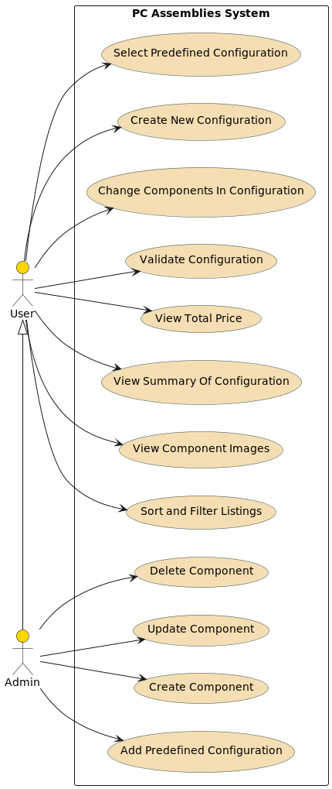
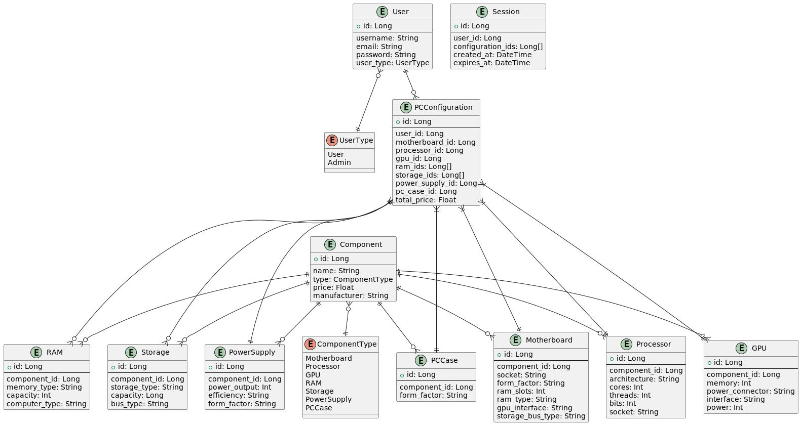
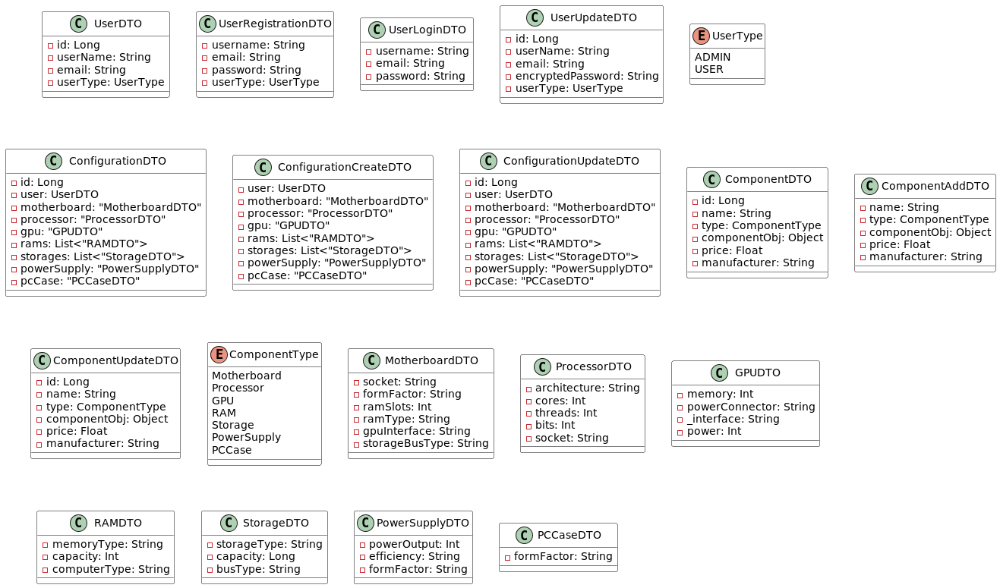

# PcAssemblies
## Project Description:
The system allows the user to select and configure a PC assembly. 
It starts by selecting office, gaming, work, high-end. 
Accordingly, it will display the basic build for that selection. 
Users the option to change the processor, operating memory, 
graphics card and possibly add peripherals or something from the 
additional menu to the PC. Each operation checks for part compatibility 
between the selected items (processors and motherboards, RAM speed, ...). 
Give options to change corresponding to the category. 
Based on the selection, the user is always shown the calculated price 
of the build and can request a summary with the configuration.

---
[Tools Used](docs/documentation/tools-used.md)

[Functionalities](docs/documentation/functionalities.md)

[How To Use Nx](docs/documentation/nx/how-to-use.md)

---
## Diagrams:

---

---

